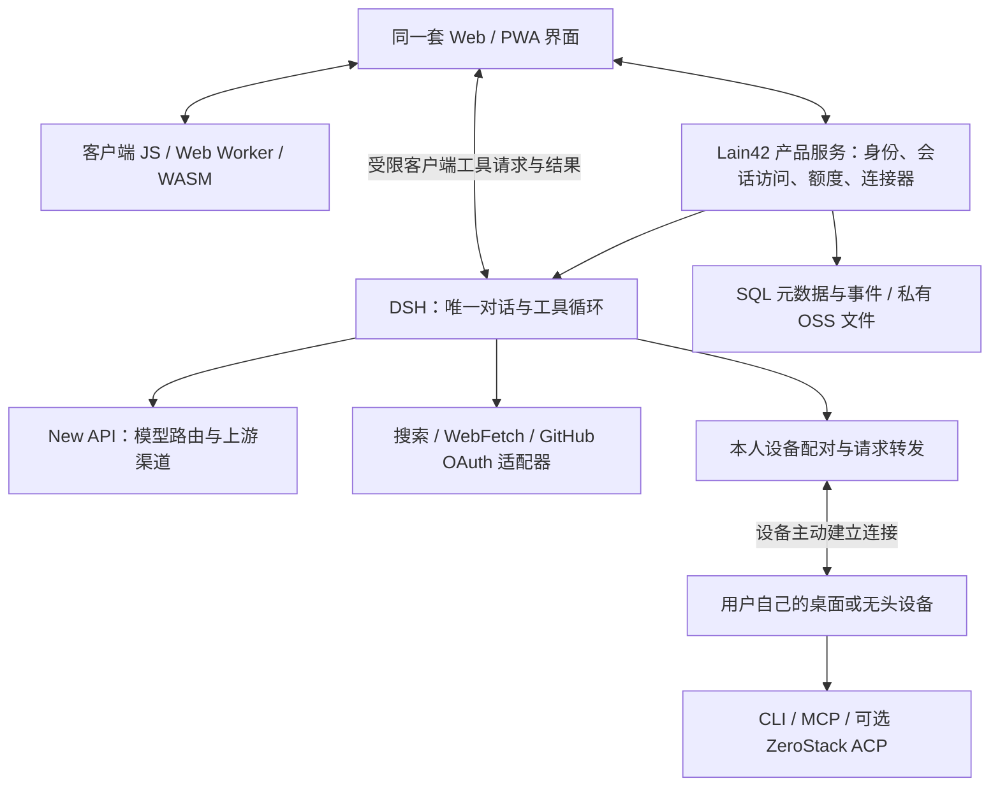

# Lain42 全平台 Agent：需求与架构重规划

Status: Proposed — 2026-09-26。本文是目标架构与迁移建议，不是已上线功能清单。

## 产品目标

任何人打开 Lain42 网页，就能使用网站模型对话、搜索资料、阅读链接、分析自己选择的文件；需要修改代码或操作电脑时，再连接自己的设备。手机与桌面使用同一套会话和授权规则。浏览器承担适合本地运行的计算，服务端承担账户、任务协调、模型接入和必要的网络服务。

Radxa A7A 是站点所有者的私人设备。它和其他用户的电脑一样，只能由设备所有者显式配对和选择；普通聊天、公开搜索和网站 GitHub OAuth 查询均不能依赖它在线。

## 需求与用户可见结果

| 场景 | 用户期望 | 必须成立的条件 |
|---|---|---|
| 打开网页直接聊天 | 正确理解当前问题，能继续上一轮 | 默认模型真实推理；错误回合不污染后续上下文；不要求安装软件 |
| 手机使用 | 聊天、附件、来源、任务进度都可操作 | 响应式 Web/PWA 优先；安装客户端不是前提 |
| 搜索或粘贴 URL | Agent 读到内容并回答，附来源 | 工具结果进入当前回合；工具完成后继续推理，不能只显示完成通知 |
| 连接 GitHub | OAuth 一次授权后能列出自己的仓库 | 网站 OAuth 独立于设备 gh；令牌不进入模型上下文 |
| 分析文件或二进制 | 客户端先解析，只发送任务所需内容 | 文件由用户选择；解析有资源限制、取消和错误反馈 |
| 代码回复 | 代码可读、可复制、带语言标识 | 客户端高亮，保留原文；大代码块不卡住输入框 |
| 让 Agent 改项目 | 在本人选定的设备和目录里操作 | 可见的目标设备、写入审批、撤销配对、输出与变更记录 |
| 扩展工具 | 增加 CLI/MCP 不必重写聊天页 | 统一注册、参数校验、授权、执行结果与呈现 |
| 保存知识 | Pin 后可检索，并选择是否刷新 | 普通用户 5 GB、会员 20 GB；私有 OSS、配额和删除一致 |
| 商业账户 | 充值或管理员发放额度后可用 | 唯一积分账本、可审计的发放、用量关联；不暗中切收费模型 |

沿用“不登录也能用”的要求：首发提供受限匿名试用；持久跨设备历史、私人连接和付费权益需要账户。匿名额度与价格属于运营配置，尚未确定具体数值。

邮件、QQ、微信、Telegram 纳入后续连接器；先完成只读、导入或草稿，再按渠道官方能力增加发送。自动回复需要用户单独启用规则，不能因连接账号就获得全部发送权限。

## 已核实的起点

线上 Agent 仍使用 New API 中改造的聊天页；DSH 尚未完成生产替换。现有前端同时承担提示词、部分工具选择和展示，迁移需要减少重复的对话控制逻辑。

DSH 已有插件化模型适配、会话事件、工具执行、附件和浏览器界面，可复用其会话与工具循环。其插件范围隔离不等于互联网多租户安全，必须另行验证身份、会话、持久化、凭据与工具权限的贯通。

现有聊天代码块使用 CodeMirror，已注册的语言扩展主要是 JS/TS 与 Markdown；Rust 未注册，高亮缺失不需要另造 WASM 引擎。粘贴出的页面文本也不足以判断原始模型回复是否包含 Markdown 围栏。

ZeroStack 的已有构建与 mock ACP 检查不能证明真实 coding 质量、生产沙箱或整站内存节省。旧建议中“DSH 同时拥有网站账户与模型网关”的职责描述由本文取代；ZeroStack 远程写入前的审批、隔离和分发核验要求继续适用。

## 方案比较

| 方案 | 实施与运维成本 | 收益及代价 | 判断 |
|---|---|---|---|
| 继续扩展 New API 聊天页 | 近期低，后续维护高 | 上线快，但账户、对话循环、工具和展示继续互相影响 | 仅保留生产缺陷修复 |
| DSH 单一对话核心 + New API 网关 + 可选设备 worker | 迁移成本中等；按模块部署、控制常驻进程数 | 复用成熟组件，业务职责可替换；需补多用户隔离和稳定网关适配 | 推荐 |
| 整站重写 Rust/WASM 或全部替换 ZeroStack | 成本与迁移风险高 | 可能降低部分运行时占用，但不直接解决模型质量、账户、CORS 或商业后台 | 暂不采用 |

采用模块化单体作为产品服务的起点，不按下图每个方块拆成独立微服务。New API 是既有独立网关，个人设备是独立执行环境；其他模块优先保持同一发布单元，按实际并发和资源测量决定拆分。

## 目标结构

DSH 通过配置和插件装配 Lain42 能力，优先复用其 Web 组件；不长期维护两套聊天页、两套上下文拼装器和两套 Agent 循环。先通过一条完整用户流程验证其多用户部署，再逐步迁移其他界面。

## 职责与数据所有权

| 模块 | 唯一职责 | 不应持有的职责 |
|---|---|---|
| Web/PWA | 输入、流式显示、代码格式、任务卡片、附件选择 | 模型渠道密钥、计费真值、基于关键词决定整轮回复 |
| 客户端执行模块 | 文件解析、格式转换、二进制分析及允许跨域的公开读取 | 自动获得磁盘、浏览器 Cookie 或任意站点访问权 |
| Lain42 账户与授权 | 用户、工作区、连接、设备所有权、会员权益 | 把客户端传来的 userId 或 tier 当授权依据 |
| DSH 运行时 | 上下文、工具循环、运行状态、可重放的会话事件 | 单独创建第二套商业账户或余额 |
| 模型网关适配器 | 调用 New API，记录上游模型、用量、错误类别 | 静默更换计费档位或伪造回答 |
| 搜索与连接器 | 返回带来源、时间、状态的结构化数据 | 直接覆盖系统提示词或代替模型结束对话 |
| 设备执行器 | 在本人明确授权的目录运行工具 | 成为全站共享 shell 或读取其他用户凭据 |
| 账本与知识存储 | 额度交易、对象清单、配额、保留与删除 | 把 OSS 当检索数据库或把网关余额当第二份积分真值 |

商业账本优先复用现有充值系统，先审计实际实现。New API 用量作为账本的计量输入；额度预留、结算和退款用同一业务请求 ID 去重。充值与管理员赠送记录不同来源，凭证可追溯，管理员赠送不伪装成链上付款。

浏览器文件默认只在本地。用户附加到模型消息后，明确展示发送的是摘录、图片还是整份文件；选择 Pin 才进入持久知识存储。OSS 使用账户绑定的私有对象键、短期访问凭证；数据库记录字节数、内容哈希、来源与版本。5/20 GB 使用十进制字节，首发保留版本计入配额，替换内容清理旧版本，内部索引另设运营容量上限。

## 一轮任务只有一个控制者

产品服务验证身份和工作区后，交给 DSH 创建运行。DSH 组装当前会话、请求模型、验证工具参数与策略、执行工具、记录结果，再请求模型生成回答。前端只投影状态，不自行补造最终答案。

每轮记录 sessionId、turnId、runId、toolCallId、事件序号及实际执行位置。失败工具记录失败原因；下一轮不把失败结果当成功事实，也不自动续做已经结束的旧问题。客户端工具结果只可完成分配给该用户、该设备或浏览器实例的待处理调用，重复结果忽略，超时与迟到结果有明确状态。

ZeroStack 是可选的委派 coding 任务。DSH 持有父任务，ZeroStack 持有自己的子任务；两者不能同时推进同一段会话或重复执行同一个写操作。首发先接确定性 CLI/MCP 工具，ZeroStack 在能证明审批和工作区隔离后再扩大使用。

浏览器断开不代表重新运行整轮任务。服务器任务可保留运行状态，页面重连按事件序号恢复；浏览器本地计算被系统挂起或关闭时标记等待或中断，不能宣传为手机后台永久运行。副作用工具的结果不明时先核验，不自动重放。

## 工具协议与选择规则

外部工具优先 MCP，已有 CLI 通过受限参数适配器接入；编码 Agent 使用 ACP 适配。MCP/ACP 不能替代产品的租户认证、配额与审批。网页任务与设备连接使用版本化应用协议，尽量复用现有桥接和 DSH 传输；不再创造第三套 Agent 工具协议。

工具注册项统一声明参数、结果、执行位置、所需授权、读写性质、超时与输出上限。新增工具实现适配器和契约用例即可，聊天界面使用通用结果卡；特殊图像或 diff 仅增加呈现组件。拒绝未知操作；可选显示字段允许兼容扩展，安全字段与必需事件不能一概忽略。

| 请求 | 默认路径 | 不可用时 |
|---|---|---|
| 普通问答 | 网站模型，无设备依赖 | 展示可理解的模型错误及重试入口 |
| 查看我的 GitHub 仓库 | 当前用户网站 OAuth | 提示连接或重新授权，不要求登录本机 gh |
| 明确要求在本人设备运行 gh | 选定设备上的 gh | 提示设备离线；不静默切换凭据身份 |
| 搜索公开资料 | 网站搜索适配器；可用时采用客户端公开源 | 返回实际失败或可用来源，不把站内检索当全网搜索 |
| 读取公开 URL | 允许 CORS 时客户端读取，否则受限服务端 WebFetch | 用户选择仅客户端时如实报告限制；不自动改变执行位置 |
| 解析用户文件 | JS/WASM 客户端计算 | 超限给出缩小文件或明确选择设备处理的入口 |
| 修改文件/执行项目命令 | 本人设备限定工作区 | 等待授权；不可改到共享网站服务器执行 |

服务端 WebFetch 校验公网地址、重定向和响应大小，防止读取内网；页面内容按资料处理，不能修改工具权限。OAuth 凭据保存在服务端账户隔离的凭据模块，本地 gh 凭据留在设备；工具结果需要发送给网站模型时，界面说明该数据流。

## 客户端计算与占用

代码高亮、复制、语言图标、Markdown 在客户端完成，按需加载语言包，长代码块延迟渲染；不为高亮启动常驻服务。Rust 高亮是当前可独立修复的展示缺口。

CPU 较重的文件/二进制解析使用 Web Worker；确有复用价值或性能收益的算法编译到 WASM。WASM 并不能绕开浏览器同源规则，也不能直接运行操作系统 gh。LLVM/WASM 编译器作为可选、按需下载工具包，不能塞进聊天首屏资源。

Tauri 可共享网页资源，但远程网页不应直接拥有任意 native shell 权限。轻量桌面壳只连接网站和本人设备执行接口；若未来提供离线本地 DSH 核心，必须单独计算 Node/runtime、模型与索引的占用，不能把壳体积当整个客户端体积。

低占用的验收按客户端首屏资源、输入响应、服务端空闲/并发 RSS、设备 worker 空闲/任务峰值分别测量。固定机器、任务和依赖版本后比较 DSH 最小配置与 ZeroStack，包含真实项目、工具输出和断连恢复；现有 mock 数据只作基线参考。

## 稳定性与质量

回答质量、工具可靠性和服务容量分别验证。换 Rust、DSH 或 ZeroStack 都不保证弱模型能正确解释 DeepSeek；默认模型必须通过真实对话与工具能力评估。免费模型池标注可用性与限制，备用模型受用户额度及成本策略约束。

基础测试包含问候、模糊短输入、多轮纠正、代码生成、常识、搜索后总结、GitHub OAuth 查询、读 URL 和附件问答。禁止把硬编码问候或特定知识答案作为模型可用的通过条件；验收记录关联真实模型请求和工具事件，但不记录密钥。

429、上游 5xx、连接失败、本地容量拒绝、工具失败分别归类。推理尚未输出时可在总截止时间内有限重试；已输出或工具有副作用时记录断点并提供恢复选择，不整轮盲重试。网关本机磁盘超限不能靠提高阈值掩盖，先处理缓存、日志保留和部署空间。

## 迁移与退出条件

1. 先锁定现有线上版本和真实失败用例；生产仅修影响可用性的缺陷，停止在旧聊天页增加新编排机制。
2. 在受保护的 `/agent-next` 验证 DSH 的最小 Lain42 配置：账户映射、网站网关、会话保存、只读工具。初期只允许测试账号，不能将共享管理员 Host 暴露给全部用户。
3. 复用既有 OAuth 连接和商业账本，通过适配器访问；不上第二套账户体系。会话事件沿用 DSH 格式，Lain42 只增加必要关联信息，不建立两个可独立修改的会话真值。
4. 按账号切换运行时，每个新回合只选择一个。历史先只读展示，导入需格式校验和备份；新旧系统不同时推理、不双扣费、不重复调用工具。
5. 通过下列验收后逐批切换。回滚恢复旧入口，新系统历史保留可读；不将新事件强塞旧格式。旧路径停止接收新任务后删除重复循环与无效前端路由。

| 阶段 | 交付边界 | 放行证据 |
|---|---|---|
| P0 三条流程原型 | 真实多轮对话；搜索/URL/GitHub OAuth→模型回答；附件→模型分析；账户隔离 | Actions 回归；真实浏览器走完三条流程；两用户不能互读；所有个人设备离线仍能聊天和检索 |
| P1 个人日常与商业化 | 本人 CLI/MCP、代码与移动体验、取消/重连、积分账本和用量核算 | 设备撤销生效、写入审批；Rust/Python/JSON 展示；输入不阻塞；充值/赠送/扣费去重 |
| P2 私有知识与桌面入口 | Pin 知识库 5/20 GB、Tauri、邮件等连接器草稿 | 并发配额不超限；数据私有；桌面复用 Web 授权；实际 Android 浏览器验收 |
| P3 按需求投入 | 自动回复、多 Agent 委派、公开算力、重型客户端编译器 | 有使用需求与成本证据，再独立设计上线 |

每阶段都交付完整用户流程，不以接口数量、工具卡片数量或 CI 编译成功代替使用验收。构建和自动化测试只在 GitHub Actions 运行；涉及平台支持时逐平台记录证据，模拟器不冒充实机。

建议增加 CI 依赖约束：UI 禁止直接导入模型渠道 SDK、私有凭据和设备进程模块；新增工具不得改聊天页里的名称分支；会话重连不得造成重复工具副作用。双用户、OAuth 撤销、工具后续答失败和客户端断连作为必测反例。

## 尚待验证的假设与风险

- DSH 能以受限插件配置承载网页多租户任务；在通过隔离验证前维持内部测试，不加载共享主机 shell/filesystem、任意插件安装或管理员设置能力。若必须进程隔离，按活跃工作区启动并回收，先测资源预算。
- 现有网站身份和充值系统可作为业务真值；需要核对账户映射、重复交易和后台权限，不能仅根据页面文案认定已完成。
- 客户端优先是成本和隐私偏好，通用网页读取允许受限服务端回退；用户明确选择客户端-only 时必须遵守。
- DSH、New API、ZeroStack 保持版本锁定与各自升级测试。工具协议稳定并不保证内部 API 十年不变；维护承诺是适配器可替换、数据可导出和旧客户端可协商能力。

## 依据

- [DSH 架构与插件职责](../../../docs/architecture.md)
- [已有私有设备所有权审查](../../../../new-api/.agents/results/architecture/architecture-review-device-ownership.md)
- [已有知识存储建议](../../../../new-api/.agents/results/architecture/architecture-recommendation-deepwiki-knowledge.md)
- [旧 ZeroStack worker 建议](architecture-recommendation-zerostack-worker.md)：安全与资源证据仍作补充，顶层职责由本文替代。
- [ZeroStack 官方仓库](https://github.com/gi-dellav/zerostack)：Rust coding agent，支持可选 MCP/ACP；上游性能数字不是本产品实测。
- [MCP 架构](https://modelcontextprotocol.io/docs/learn/architecture)：工具与数据连接的标准接口。
- [ACP 官方介绍](https://agentclientprotocol.com/get-started/introduction)：编辑器与 coding agent 通信；远程能力仍需产品自行验证。
- [WebAssembly 安全模型](https://webassembly.org/docs/security/)：浏览器中的 WASM 受宿主安全与同源策略约束。
