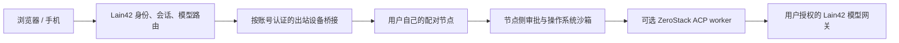

# ZeroStack worker 接入建议

Status: Recommended conditionally; remote write execution remains disabled.

## 决策

保留 DeepSeek Harness（DSH）作为 Lain42 的 Web／手机产品层、会话与模型路由核心。ZeroStack 只作为可选的、由用户在自己配对设备上运行的低资源 coding worker；不在共享网站服务器启动用户任务，也不让用户通过网页指定任意可执行文件、参数、工作目录或环境变量。

这条建议解决的是“用户节点上的 worker 进程占用更小”，不是降低网站服务端内存。GitHub Actions 的最新空闲会话测量中，ZeroStack `--no-default-features --features acp` 的平均 RSS 为 Windows x64 14,036 KiB、Linux x64 23,581 KiB、Linux ARM64 21,330 KiB。测量没有包含模型推理，也没有与 DSH 做同机、同任务比较，因此目前只能确认 ZeroStack 自身较轻，不能声称端到端节省已证明。详见[接入条件与测量记录](../../notes/proposed/architecture/2026-09-25-zerostack-acp-worker-admission.md)。

## 方案比较

| 方案 | 好处 | 代价与风险 | 结论 |
|---|---|---|---|
| 只用 DSH | 身份、会话、模型和审批规则留在一套运行时，维护面最小 | 失去可选的小型独立 worker | 保持为默认路径 |
| DSH + 用户本机 ZeroStack ACP | coding worker 可在用户设备运行；ACP-only 配置较轻 | 当前 ACP 会自动批准 `Ask`，sandbox 不覆盖 agent 自有文件工具和 MCP；还要处理每账号隔离、Windows/ARM 沙箱与 GPL-3.0-only 分发义务 | 目标方向，但安全门完成前只允许本机个人实验 |
| 用 ZeroStack 替换 DSH | 独立 coding agent 功能完整且精简 | 缺少 Lain42 的 Web/手机界面、账号隔离和模型网关；当前 ACP 权限行为不适合远程写入 | 不采用 |

## 假设与非目标

- 目标是降低用户配对节点上 coding worker 的额外 RAM，不是压缩模型本身或网站服务端。
- DSH 继续拥有 Web／手机交互、用户会话和模型网关；ZeroStack 不成为新的产品主界面。
- 每个用户只连接自己的节点。把 Haoyu 的个人 Radxa 或任意用户节点变成多人共享的算力池不在范围内。
- 目前不开放公网 SSH，也不允许网页直接提交任意 shell 命令。

## 目标边界

图中“节点侧审批与操作系统沙箱”是接入前置条件，目前尚未由 ZeroStack ACP 满足。现有 Lain42 设备桥按账号和 device ID 校验所有权；云端只应转发固定、版本化的 worker 请求，不应接收节点路径或启动用户提供的命令。任何情况下都不把产品所有者的 Radxa A7A 放入共享 worker 池。

## 放行门槛

1. ZeroStack ACP 将每次危险工具请求交给可见的人类审批，或在没有审批客户端时拒绝；回归测试证明没有静默 `AllowOnce`。
2. 每个账号的 worker 独立运行于可验证的 OS 沙箱；文件、shell、MCP、符号链接均无法读写所选 workspace 外的数据。缺少沙箱时必须拒绝执行。
3. 桥接只解析固定 ACP 消息和能力，不接受浏览器提供的命令、进程参数、路径、环境变量或其他用户的 worker ID；设备撤销、断线、重连、请求上限均有测试。
4. Windows x64、Linux x64、Linux ARM64 的构建、ACP 握手、拒绝/批准路径和内存基线都由 GitHub Actions 执行；不在开发者本机编译。
5. 增加无真实凭据的 mock OpenAI-compatible gateway 测试，覆盖 `/models`、认证和流式 `/chat/completions`；真实网关试用只使用用户自行签发、保存在本人节点上的受限 key。
6. 同一 Actions runner 上用相同 mock coding 任务，比较 DSH 与 ZeroStack 的 idle/active RSS、任务结果与时延。通过前不宣传端到端内存收益。
7. 任何面向用户的 ZeroStack 下载或捆绑发布前，完成 GPL-3.0-only notices、源码提供和发行义务审查。

## 迁移顺序

先保持当前 DSH 工具执行路径与只读工具可用；单独加入可选的节点本机 ZeroStack adapter，只连接该用户已配对的设备；先上线 read-only ACP；完成 ACP 审批和 OS 沙箱后，再让用户按请求授权写操作。worker 无法验证身份、审批或沙箱时，回退到 DSH 既有工具或返回可理解的拒绝信息，不回退到共享服务器执行。
