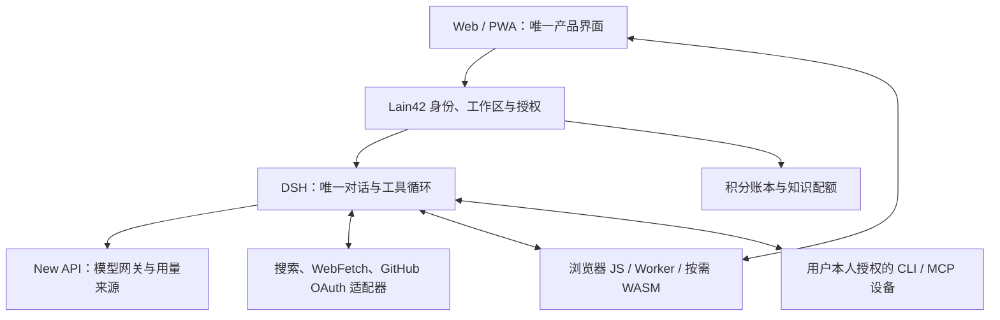

# Lain42 全平台 Agent：目标与执行计划

状态：活动目标的验收版规划。架构方案见 [平台架构建议](../architecture/architecture-recommendation-lain42-platform.md)。本文件记录产品目标与放行条件，不代表线上功能已经完成。

## 目标

把 Lain42 做成打开网页或手机即可使用的全平台 Agent：访客可受限试用，登录用户默认使用网站模型；真实聊天、资料检索后回答、附件分析三条流程必须可靠；GitHub 等账户授权、会话、文件和设备按用户隔离；只有需要操作 CLI 或项目时，才连接用户本人授权的设备。客户端承担适合浏览器运行的解析和展示；Lain42 统一管理积分账本、用量以及普通用户 5 GB／会员 20 GB 的私有知识空间。

普通聊天、公开搜索和网站 GitHub OAuth 查询不得依赖任何个人设备在线。Radxa A7A 只属于站点所有者，是其本人可选的设备，不能作为其他用户的共享 Agent 后端。

### 产品与架构边界

- **用户入口**：一套响应式 Web/PWA 体验覆盖桌面浏览器与手机；Tauri 只复用这套产品，不另造聊天、会话或授权逻辑。匿名访客仅获得受限试用，跨设备历史、私人授权和付费权益绑定登录账户。
- **对话与模型**：DSH 是唯一对话、上下文和工具循环；New API 是模型路由与用量来源；Lain42 持有账户、工作区、授权、额度和产品数据。只有通过多用户隔离验收的 DSH 功能才可承载真实用户。
- **工具执行位置**：搜索与网页读取根据 CORS、SSRF 风险和目标站限制选择浏览器或受限服务端适配器；文件预览、语法高亮和适合的解析放在 JS/Worker/WASM；CLI/MCP 只在用户明确选择的本人设备上执行。WASM 不能绕过浏览器同源策略，也不能取代本机 CLI。
- **数据与商业化**：OAuth 凭据由 Lain42 安全保存并按用户授权调用，不进入模型上下文；附件默认由用户选择并确认发送，Pin 后才进入私有知识空间。积分、管理员赠送、模型用量、扣费和退款使用可审计的统一账本；会员身份和配额由服务端校验。
- **长期边界**：MCP/CLI/ACP 作为可替换适配协议，不能替代租户认证、权限、审计和数据所有权。ZeroStack 是可选的后续 coding worker，先证明资源收益、沙箱和审批，再投入集成；不为追求 WASM 或框架替换而重写产品。

## 本轮目标修订（2026-09-27）

**唯一首要目标：**任何用户在网页或手机浏览器中，都能用网站模型完成连续对话；搜索、公开 URL、GitHub OAuth 和用户确认的附件，必须把实际读取到的资料交给同一轮模型并生成有依据的回答；用户之间不能互读数据。普通流程在所有个人设备离线时仍可用。

架构冻结为“一套界面、一个对话核心、按任务选择执行位置”：Web/PWA 负责交互；Lain42 负责身份、授权、额度和数据归属；DSH 是唯一对话与工具循环；New API 是模型网关；浏览器 JS/Worker/WASM 负责适合本地的解析和展示；本人设备只作为可选 CLI/MCP 执行端。当前不再新增第二套聊天循环，也不以换成 Rust/WASM、接入 ZeroStack 或增加工具卡片代替端到端可用性。

### 已有证据与缺口

| 能力 | 当前证据 | 验收状态 |
|---|---|---|
| 普通问候与纠正上一轮 | 对话修复已通过 Actions，并用真实模型做过浏览器抽查；不同免费模型的回答质量仍有差异 | 部分通过；需纳入多模型回归 |
| 粘贴公开 URL 后回答 | 中文句末标点截断修复已通过 Actions；线上读取 ast-grep README，并由模型概括和附来源 | 单场景通过；需纳入流程回归 |
| 浏览器公开搜索后回答 | Actions 前端/后端门禁通过；部署 `agent-flat-4250c34` 后，在真实网页用“请用浏览器公开索引搜索 ast-grep 官方项目……”验证，模型根据浏览器 GitHub 索引返回项目用途和可打开来源；该请求未访问账号仓库 | 单场景通过；需纳入多模型与搜索类别回归 |
| GitHub OAuth 后回答 | OAuth 连接状态已显示，但不能仅凭卡片或工具完成事件认定读取内容并回答成功 | 未通过 |
| 附件解析后回答 | 尚无完整浏览器验收证据：预览、确认发送、模型引用实际内容、取消/错误恢复 | 未通过 |
| 双账号隔离 | 尚无两名测试用户互相访问会话、连接和附件的完整验收记录 | 未通过 |
| 设备离线独立性 | A7A 离线时普通网页聊天仍可使用；该设备保持站点所有者私有 | 初步通过；需加入自动化验收 |

### 唯一下一放行门

在开展新连接器、公开设备执行、知识库扩容或桌面壳等扩展前，先一次性补齐以下 P0 证据：

1. 真实模型多轮对话能处理问候、短追问、纠正和前一轮工具失败；上一轮失败不能污染新问题。
2. 浏览器公开搜索、粘贴 URL、网站 GitHub OAuth 三种输入，都能把实际内容送进当前轮模型，并得到可核验来源；OAuth 失败不要求用户登录本机 `gh`。
3. 用户选择文件后能先查看解析范围，确认后才发送；模型回答能引用文件实际内容；取消、超限、失败和重试状态明确且不重复提交。
4. 两个测试账号不能读取对方的会话、OAuth 连接、附件、设备或用量；关闭所有个人设备后，普通对话、公开搜索和网站 OAuth 仍可用。
5. 对应 Actions 自动化通过，并在真实浏览器完成上述流程；CI 通过只是必要条件，不单独作为上线完成证明。

在这道放行门通过前，只修复阻断上述流程的问题，保留旧入口和可回滚路径；不把尚未验证的能力标记为完成。完成后再按 P1 推进本人设备、积分账本和移动体验，P2 推进私有知识空间与桌面入口。

## 第一阶段：三条端到端流程必须全部跑通

| 流程 | 完成条件 |
|---|---|
| 真实聊天 | 网页、手机浏览器和 PWA 使用同一套会话体验；受限访客可试用，登录用户可跨设备续聊；真实调用网站模型，问候、常识、多轮纠正和追问都答当前问题。 |
| 资料检索后回答 | 搜索、粘贴公开 URL、读取用户 OAuth 授权的 GitHub 仓库，实际资料回到同一轮模型并产出答案和来源；OAuth 不要求本机 `gh`，设备离线不影响。受限站点和搜索故障要明确说明。 |
| 附件分析 | 浏览器先解析用户选择的文件并展示将发送的范围；用户确认后才交给当前模型。支持取消、大小限制、清晰错误与不重复提交；CPU 密集工作用 Worker/按需 WASM。 |

这三条流程都必须基于真实模型请求和真实工具/附件数据，不接受硬编码答案、仅显示工具完成提示或只通过 CI 编译作为验收。普通聊天、搜索和网站 GitHub OAuth 在所有个人设备离线时仍可用。每条流程都通过双账号隔离测试。

## 后续阶段：完整产品能力

| 能力 | 完成条件 |
|---|---|
| 本人设备 | 设备是可选的、按用户隔离的 CLI/MCP 执行器。每次任务明确显示目标设备和权限；设备离线不影响聊天、搜索和 OAuth。 |
| 商业化 | 统一积分账本记录充值、管理员赠送、预留、用量、扣费和退款；管理员操作可追溯，重复事件不重复入账。 |
| 私有知识空间 | 普通用户 5 GB、会员 20 GB；对象私有，配额并发安全，删除和替换能回收空间。 |
| 移动与桌面 | 手机浏览器和 PWA 可完成主要流程；Tauri 复用同一网页体验与授权，不另建业务逻辑。 |

## 架构决定

- **DSH** 是唯一的会话和工具循环；从受保护的新入口开始迁移，不一次推倒线上聊天页。
- **New API** 继续负责模型路由和上游用量，不再增加第二套商业账户或余额真值。
- **Web/PWA** 是首发产品；Tauri 之后复用同一体验，不另建业务逻辑。
- **JS/Worker/WASM** 处理代码展示和合适的本地解析。WASM 不绕过 CORS，也不能替代操作系统 CLI。
- **工具** 使用通用注册与结果呈现；MCP/CLI/ACP 是适配协议，授权与租户隔离仍由 Lain42 控制。
- **设备** 由设备所有者配对并发起出站连接；禁止把个人 Radxa 变成共享 worker，也不向公网开放设备 SSH。
- **持久数据** 在服务端按账户隔离；浏览器访客数据单独命名空间。知识对象存储使用私有 OSS 键和短期授权。

## 阶段与依赖

### P0：交付三条完整用户流程

1. **对话正确性**：为每轮建立稳定关联；区分当前问题、引用的上一轮和未完成工具调用。失败或超时的旧轮不能污染新问题。
2. **模型可靠性**：普通问答不调用设备；区分限流、上游错误、连接中断和容量拒绝；仅在没有副作用、且尚未输出时有限重试。
3. **工具闭环**：搜索、WebFetch 和 GitHub 读取结果回到同一轮对话，由模型完成综合回答；工具完成通知不能替代模型回答。
4. **附件闭环**：浏览器预览并解析用户选中的文件；确认发送后将实际内容交给当前模型，支持取消、大小限制、错误反馈和不重复提交。
5. **身份隔离**：服务端根据已验证会话确定 user/workspace；不能相信客户端传来的 userId。GitHub OAuth、会话、文件、设备和用量都按所有者授权。

**P0 放行证据**：GitHub Actions 中真实多轮聊天、搜索/URL/GitHub OAuth→模型回答、附件→模型分析三类回归通过；浏览器走完三条流程并看到真实结果和来源；两个测试账号互相不能读取会话、凭据或附件；断开所有个人设备后普通聊天、搜索和 OAuth 仍成功。错误响应给出可理解的下一步。

### P1：让个人日常工作和付费使用可靠

1. **本人设备执行**：CLI/MCP 只运行于明确选择、归当前用户所有的设备和允许目录；写操作需确认；断连后可恢复观察状态，不盲目重放副作用。
2. **积分账本**：统一充值、管理员赠送、预留、消费、退款事件；用模型网关用量核算；幂等防止重复扣款；管理员行为可审计。
3. **移动与代码体验**：手机端输入、上传、取消、重连和来源链接可用；Markdown、复制、语言标识和 Rust 等常用语言高亮在浏览器完成；响应式 Web/PWA 是验收对象，桌面壳不是前置条件。

**P1 放行证据**：设备双账号隔离和撤销用例通过；积分并发扣费只记一次且用户可对账；Rust/JSON/Markdown 展示回归通过；移动端上传、取消、重连和来源链接可用。

### P2：扩展知识与桌面入口

1. **Pin 知识库**：普通用户 5 GB、会员 20 GB；账户配额预留、并发上传、版本替换和删除一致；对象私有，索引可重建。
2. **桌面客户端**：Tauri 作为同一 Web 产品的安装入口；本地能力仍通过同一授权和设备协议。
3. **更多连接器**：邮件、QQ、微信、Telegram 等先完成只读/草稿，再单独做用户启用的发送规则。

**P2 放行证据**：并发超额上传不能突破配额；删除后空间释放；账号之间无法猜测或访问对象；桌面和 Web 的会话、授权语义一致。

## 不纳入本轮目标

- 不重写整个产品为 Rust/WASM，不因“客户端优先”而把所有抓取都塞进浏览器。
- 不用关键词规则或硬编码答案假装模型正常。
- 不要求用户登录本机 `gh` 才能使用网站 GitHub OAuth。
- 不让所有用户绑定站点所有者的 A7A，也不把个人设备用于共享流量。
- 不在没有真实需求和隔离证据前开放公开算力出租或自动代发消息。
- 不把 DSH、ZeroStack、MCP 或 CI 构建成功直接当成产品流程完成。

## 全阶段质量门槛

- 构建和自动化测试只在 GitHub Actions 运行；本地不执行项目构建或测试。
- 每个阶段先有自动化行为用例，再做浏览器端真实流程验收。模拟器结果不得冒充 Android 实机结果。
- 每次工具执行都能关联用户、会话、轮次、工具调用和执行位置；日志不记录访问令牌或密钥。
- 不部署未通过 CI 的版本；失败后如实报告阻塞和已有证据，不声称“已经修好”。
- 每个阶段只替换已通过验收的路径；旧入口在新入口完成真实用户验证前保留回滚能力。

## 执行顺序

先审计线上错误并建立可复现回归集；第一道放行门同时要求三条用户流程成立：真实多轮聊天、搜索/URL/GitHub OAuth→模型回答、用户确认后的附件→模型分析，并完成双账号隔离。通过后再推进本人设备 CLI/MCP、积分账本和移动体验；随后交付 5/20 GB 私有知识空间与 Tauri 桌面入口。任何阶段都不以框架能力、工具卡片或 CI 构建成功代替真实浏览器流程验收。
